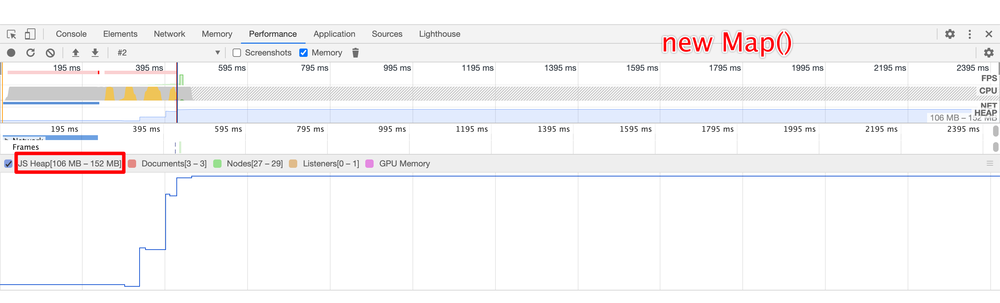
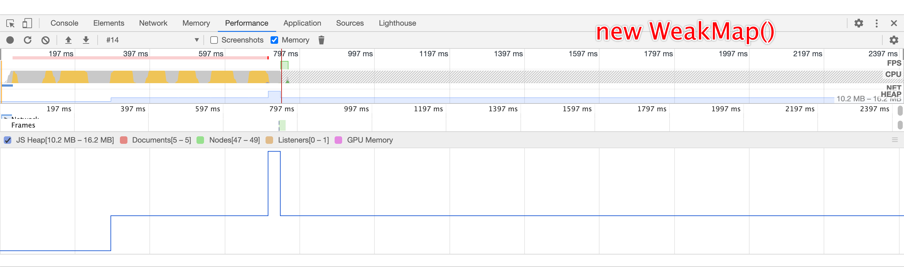

# Vue 响应式和依赖收集

阅读本文前无需了解 Vue2 响应式原理，只需要大致了解，Vue3 使用了 `Proxy` (ES6 的代理对象)，通过**直接代理对象**实现**数据劫持**，**无需遍历属性依次使用 `Object.defineProperty` 设置 `get`、`set`** 来实现。所以，简而易见，在 _原理_ 上 Vue2、3 目前最大的区别就是：

- 兼容性：Vue3 使用了“新”语法，IE 不兼容

- 速度：Vue3 无需遍历属性进行预处理

此外，尤大独立出响应式的模块，可以让我们在任何地方直接使用。所以本文重点讲解 `vue/reactivity` 响应式和依赖收集的原理。

## 让我们体验一下

安装、引入

```bash
// 建个目录后
yarn init -y
yarn add @vue/reactivity
```

建一个 `html` ，实现一个页面时钟 ：

```html
<!DOCTYPE html>
<html>
  <body></body>
  <script src="./node_modules/@vue/reactivity/dist/reactivity.global.js"></script>
  <script>
    const { reactive, effect } = VueReactivity;
    // 创建响应式对象（被代理后的）
    const state = reactive({
      time: new Date(),
    });
    // 收集依赖函数
    effect(() => {
      // 这里使用到响应式对象的属性（换句话说，这里依赖响应式对象的 time 属性），
      // 然后这个函数就会被收集起来，当再触发该属性变化时，就会执行之前收集的依赖函数。
      document.body.innerHTML = state.time.toLocaleString();
    });
    setInterval(() => {
      // 修改被收集了依赖的属性（导致触发依赖这个属性的函数）
      state.time = new Date();
    }, 1000);
  </script>
</html>
```

效果图：


## 复习小学课本

### 回顾 `Proxy`

#### 支持的 13 中代理/拦截的方法（来自阮一峰 ES6 入门）

- **get(target, propKey, receiver)**：拦截对象属性的读取，比如`proxy.foo`和`proxy['foo']`。
- **set(target, propKey, value, receiver)**：拦截对象属性的设置，比如`proxy.foo = v`或`proxy['foo'] = v`，返回一个布尔值。
- **has(target, propKey)**：拦截`propKey in proxy`的操作，返回一个布尔值。
- **deleteProperty(target, propKey)**：拦截`delete proxy[propKey]`的操作，返回一个布尔值。
- **ownKeys(target)**：拦截`Object.getOwnPropertyNames(proxy)`、`Object.getOwnPropertySymbols(proxy)`、`Object.keys(proxy)`、`for...in`循环，返回一个数组。该方法返回目标对象所有自身的属性的属性名，而`Object.keys()`的返回结果仅包括目标对象自身的可遍历属性。
- **getOwnPropertyDescriptor(target, propKey)**：拦截`Object.getOwnPropertyDescriptor(proxy, propKey)`，返回属性的描述对象。
- **defineProperty(target, propKey, propDesc)**：拦截`Object.defineProperty(proxy, propKey, propDesc）`、`Object.defineProperties(proxy, propDescs)`，返回一个布尔值。
- **preventExtensions(target)**：拦截`Object.preventExtensions(proxy)`，返回一个布尔值。
- **getPrototypeOf(target)**：拦截`Object.getPrototypeOf(proxy)`，返回一个对象。
- **isExtensible(target)**：拦截`Object.isExtensible(proxy)`，返回一个布尔值。
- **setPrototypeOf(target, proto)**：拦截`Object.setPrototypeOf(proxy, proto)`，返回一个布尔值。如果目标对象是函数，那么还有两种额外操作可以拦截。
- **apply(target, object, args)**：拦截 Proxy 实例作为函数调用的操作，比如`proxy(...args)`、`proxy.call(object, ...args)`、`proxy.apply(...)`。
- **construct(target, args)**：拦截 Proxy 实例作为构造函数调用的操作，比如`new proxy(...args)`。

#### 用 `get` / `set` 举个没什么用的例子：

```js
const obj = {
  score: 1, // 只允许赋值number类型，获取只能获取其两倍的值
};

const get = (target, key, receiver) => {
  // 加倍
  return target[key] * 2;
};
const set = (target, key, value, receiver) => {
  // 过滤其他类型
  if (key === "score" && typeof value !== "number") {
    return false;
  }
  target[key] = value;
  return true;
};

const realObj = new Proxy(obj, { get, set });

obj.score = "xx"; //  无效
console.log(obj.score); // 2
obj.score = 99;
console.log(obj.score); // 198
```

### 回顾 `WeakMap`

和 `Map` 一样，只是不能遍历，仅保持**弱引用**（对比`Map`，如果 `Map` 本身不被销毁，则其引用也不会被销毁，容易造成内存泄漏）

```html
<!DOCTYPE html>
<html>
  <body></body>
  <script>
    // const map = new Map(); // 见下方第一张图，内存占用严重
    const map = new WeakMap(); // 见下方第二张图，内存会被释放
    for (let i = 0; i < 999999; i++) {
      map.set({}, i);
    }
  </script>
</html>
```





## 响应式

通过刚刚的复习，让我们连实现一个简单的响应式，继续实现一个页面时钟。

```html
<!DOCTYPE html>
<html>
  <body></body>
  <script>
    const tempState = { time: new Date() };
    const set = (target, key, value) => {
      target[key] = value;
      if (key === "time") {
        setBodyTime();
      }
      return;
    };
    const state = new Proxy(tempState, { set });
    const setBodyTime = () => {
      document.body.innerHTML = state.time.toLocaleString();
    };
    setInterval(() => {
      state.time = new Date();
    }, 1000);
  </script>
</html>
```

可以看到，为了实现 `state.time` 的响应式，在代理方法写了**硬代码**，当修改( `set` ) `time` 属性时，执行需要用到 `time` 属性的 `setBodyTime` 方法。

如果有一种方式，可以自动收集“依赖该属性值的方法”就好了。是的，通过拦截数据的 `get/set` 是可以实现自动依赖收集的，来，下面让我们撸一个。

## 搭个空壳

```js
const reactive = (target) => {
  // createReactiveObject
  return new Proxy(target, { get, set });
};

// effect 收集依赖的API
const effect = (fn) => {
  // createReactiveEffect
  const effect = () => {
    // 真正的依赖函数
    fn();
  };
  effect(); // 必须要执行一次，才能收集到 fn 的依赖
  return effect;
};

const get = (target, key) => {
  // track 追踪
  // 存 effect

  return target[key];
};
const set = (target, key, value) => {
  target[key] = value;

  // trigger 触发
  // 调用 effect

  return true;
};
```

## 伪代码

```js
const reactive = (target) => {
  if (!isObject(target)) {
    return target
  }
  if (/* hasExistingProxy */) {
    return existingProxy
  }

  // createReactiveObject
  return new Proxy(target, { get, set })
}

// 全局暂时记录当前执行的 effect
let activeEffect = null
// effect 收集依赖的API
const effect = (fn) => {
  const effect = () => {
		activeEffect = effect
    // 在执行期间，获取响应式对象的值时，则会执行 Proxy get()
    // 此时 get 方法就可以通过 activeEffect 获取到当前执行的 effect
    fn()
    activeEffect = null
  }
  effect()
  return effect
}

// 使用 WeakMap 记录依赖
const targetMap = new WeakMap()
const get = (target) => {
  // track 追踪，记录方式如下（伪代码）：
  targetMap.set({
    [target]: {
      [key]: new Set([activeEffect]) // 记录 effct
    }
  })

  return target[key];
}
const set = (target, key) => {
  target[key] = value;

  // trigger 触发
  targetMap.get(target)[key].forEach(effect => effect())

  return true
}
```

## 稍微完善一下，跑起来！！

```js
const isObject = (v) => typeof v === "object" && v !== null;

// 代理缓存
const proxyMap = new WeakMap();

const reactive = (target) => {
  if (!isObject(target)) {
    return target;
  }
  const existingProxy = proxyMap.get(target);
  if (existingProxy) {
    return existingProxy;
  }

  const baseHandlers = {
    get,
    set,
  };
  // createReactiveObject
  return new Proxy(target, baseHandlers);
};

let activeEffect = null;
// effect 收集依赖的API
const effect = (fn) => {
  // createReactiveEffect
  const effect = () => {
    activeEffect = effect;
    // 在执行期间，获取响应式对象的值时，则会执行 Proxy get()
    // 此时 get 方法就可以通过 activeEffect 获取到当前执行的 effect
    fn();
    activeEffect = null;
  };
  effect();
  return effect;
};

const targetMap = new WeakMap();
const get = (target, key) => {
  // track
  // 依赖收集，使用 WeakMap 将 target 作为键
  // 下面一堆基本都是判空逻辑
  if (activeEffect) {
    let depsMap = targetMap.get(target);
    if (!depsMap) {
      targetMap.set(target, (depsMap = new Map()));
    }
    let dep = depsMap.get(key);
    if (!dep) {
      depsMap.set(key, (dep = new Set()));
    }
    dep.add(activeEffect);
  }

  return target[key];
};
const set = (target, key, value) => {
  target[key] = value;

  // trigger
  // 批量触发收集的依赖函数
  const depsMap = targetMap.get(target);
  if (depsMap && depsMap.get(key)) {
    depsMap.get(key).forEach((effect) => effect());
  }

  return true;
};
```

把开头体验一下的代码引用部分换成刚刚完善的，是可以看到页面时钟，

随着功能趋于完善，代码也需要做适当的拆分，来看看拆分效果。

## 代码拆分

### `reactive.ts`

```ts
import { isObject } from "@/shared";
import { mutableHandlers } from "./baseHandlers";

const proxyMap = new WeakMap();

export const reactive = (target) => {
  return createReactiveObject(target);
};

function createReactiveObject(target) {
  if (!isObject(target)) {
    return target;
  }
  const existingProxy = proxyMap.get(target);
  if (existingProxy) {
    return existingProxy;
  }

  return new Proxy(target, mutableHandlers);
}
```

### `effect.ts`

```ts
export function effect(fn) {
  const effect = createReactiveEffect(fn);

  effect();

  return effect();
}

let activeEffect;

function createReactiveEffect(fn) {
  const effect = () => {
    activeEffect = effect;
    fn();
    activeEffect = null;
  };

  return effect;
}

export function track(target, key) {
  if (activeEffect) {
    let depsMap = targetMap.get(target);
    if (!depsMap) {
      targetMap.set(target, (depsMap = new Map()));
    }
    let dep = depsMap.get(key);
    if (!dep) {
      depsMap.set(key, (dep = new Set()));
    }
    dep.add(activeEffect);
  }
}

export function trigger(target, key) {
  const depsMap = targetMap.get(target);
  if (depsMap && depsMap.get(key)) {
    depsMap.get(key).forEach((effect) => effect());
  }
}
```

### `baseHandlers.ts`

```ts
import { track, trigger } from "./effect.ts";

function createGetter() {
  return function get(target, key, receiver) {
    const res = target[key];
    track(target, key);
    return res;
  };
}

function createSetter() {
  return function set(target, key, value, receiver) {
    target[key] = value;
    trigger(target, key);
    return true;
  };
}

const get = createGetter();
const set = createSetter();

export const mutableHandlers = {
  get,
  set,
};
```

大致拆分完毕

## 小总结

如果看懂了上述依赖收集的代码和代码拆分后的结构，就可以很轻松的读懂尤大的源码。

但是，这毕竟只是超级无敌丐版，还有诸多细节需要完善，比如需要处理

- 嵌套`effect`： `effect(()=> effect(() => console.log(state.num)))`
- 无限递归：`effect(() => state.num++)`
- `Array` 的各种情况，如：
  - 超长度赋值， `arr[1000000] = 1`
  - 直接将长度改小，`arr.length = 3 // 原本arr.length > 3`
  - 依赖别的 item，`arr.indexOf/includes/lastIndexOf`
  - 数组的操作方法、操作过程不应该记录为依赖，`arr.push/pop/shift/unshift/splice`
- 一些简单的细节，去看源码，一看就 fei，本文就不做解释了
  - `Set`、`Map`、`WeakSet`、`WeakMap` 集合类型的支持
  - `Reflect` 的使用

## 细节处理

### 嵌套`effect`

```js
effect(() => {
  // ① 此时会将 let activeEffect = ①
  state.name = "vito";
  effect(() => {
    // ② 此时会将 let activeEffect = ②
    state.age = "18";
  });
  state.adress = "sz"; // 此时，不应该收集的是 ② activeEffect
  // 而应该是上一个还没执行完的 ① activeEffect
  // 而且 ② 还可能要存在多层嵌套的情况，所以 ① 要等所有嵌套的执行完毕后，才能继续作为 activeEffect。
});
```

这种需要 **先进后出，后进先出** 的情况，就很容易想到，使用 **栈** 型结构，用栈来缓存还未执行完毕，被别的 activeEffect 暂时替换的 `effect`。

```js
// effect 栈
const effectStack = [];
let activeEffect;
function createReactiveEffect(fn, options = {}) {
  const effect = function() {
    activeEffect = effect;
    effectStack.push(activeEffect);
    fn();
    effectStack.pop();
    activeEffect = effectStack[effectStack.length - 1];
  };
  return effect;
}
```

### 无限递归

```js
effect(() => {
  state.num = state.num + 1; // 先 get 后 set ，set 又会触发之前 get 的时候收集的依赖
});
```

这里都是同步的代码，流程是：

```text
effect() -> effectStack.push(activeEffect = effect) -> fn() -> get -> track -> set -> trigger -> effect() -> effectStack.push(activeEffect = effect) -> fn() -> ...
```

这里可以看到，会不断的 `push` 同一个 `effect` ，所以加个判断即可解决。

```js
const effectStack = [];
let activeEffect;
function createReactiveEffect(fn, options = {}) {
  const effect = function() {
    // 防止无限递归
    if (effectStack.includes(effect)) return;
    activeEffect = effect;
    effectStack.push(activeEffect);
    fn();
    effectStack.pop();
    activeEffect = effectStack[effectStack.length - 1];
  };
  return effect;
}
```

### 数组的各种情况

**情况 1**：超长度赋值， `arr[1000000] = 1`

​ 此时应该触发 依赖`arr.length、arr[1000000]`的 `effect`

**情况 2**：直接将长度改小，`arr.length = 3 // 原本arr.length > 3`

此时应该触发，依赖 `arr.length`、 `arr[index >= 3]`的 `effect`

> 聪明的你应该发现了`arr[index >= 3]`肯定有多个 `effect` 需要批量执行，并且如果发生遍历数组的话，就会对数组各个`index`产生依赖，并记录同一个`effect`，但是在 `trigger` 执行 `effect` 时，不应该重复执行多次。比如：
>
> ```js
> effect(() => arr.forEach((item) => console.log(item)));
> // 此时的依赖记录关系
> /*
> 	targetMap {
> 		[arr]: {
> 			[1]: [effect] // effectsSet
> 			[2]: [effect] // effectsSet
> 			[3]: [effect] // effectsSet
> 			...
> 		}
> 	}
> */
> arr.length = 0; // 发生 trigger，此时应该只需触发一次 effect 即可
> ```
>
> 所以这里在 `trigger` 里用 `new Set` 来存需要批量执行的 `effect`
>
> ```js
> function trigger(target, key, newValue) {
>   const depsMap = targetMap.get(target);
>
>   const effects = new Set(); // 存待执行的 effect
>
>   // 批量将制定 key 值的依赖加入到 effects
>   const add = (effectsSet) => {
>     effectsSet.forEach((effect) => {
>       effects.add(effect);
>     });
>   };
>   // 根据各种条件触发 add effects
>   // ...（下述的代码片段位置将在这里）
> }
> ```

解决办法如下（伪代码）：

```js
if (key === 'length' && isArray(target)) {
  depsMap.forEach((dep, key) => {
    if (key === 'length' || key >= newValue) { // 在或运算符后面，此时的 key 是索引， newValue 是 新长度。见情况2
      add(dep)
    }
  })
} else {
  if (key !== void 0) {
    add(depsMap.get(key)) // 老老实实的将操作的 key 下的 effect 添加到待执行。
  }
  // isAdd 是在触发 trigger 时，通过 !hasKey 或 >=length 来判断是新增ADD操作还是设置SET操作。
  if (/* isAdd */) {
    if (isArray(target) && isIntegerKey(key)) {
      // new index added to array -> length changes
      add(depsMap.get('length')) // 见情况1
  	}
  }
}


```

**情况 3**：依赖别的 item，`arr.indexOf/includes/lastIndexOf`

**情况 4**：数组的操作方法、操作过程不应该记录为依赖 `arr.push/pop/shift/unshift/splice`

这里的解决方式都是在对数组进行 `get` 这些方法的时候，返回另个一个被包装的方法。

```js
const arrayInstrumentations = {
  includes() {}, // 包装后的 Array.prototype.includes
  indexOf() {}, // 包装后的 Array.prototype.indexOf
  lastIndexOf() {}, // 包装后的 Array.prototype.lastIndexOf
  ...
}
function createGetter() {
  return function get(target, key) {
    // ...
    if (isArray(target) && hasOwn(arrayInstrumentations, key)) {
      return arrayInstrumentations[key] // 返回被包装的方法
    }
    //...
  }
}
```

根据他们的特性，情况 3：**依赖别的 item**；情况 4：**数组的操作方法、操作过程不应该记录为依赖**。

```ts
// 源码如下，备注为中文注释

const arrayInstrumentations: Record<string, Function> = {};
(["includes", "indexOf", "lastIndexOf"] as const).forEach((key) => {
  const method = Array.prototype[key] as any;
  arrayInstrumentations[key] = function(this: unknown[], ...args: unknown[]) {
    const arr = toRaw(this);
    // 'includes', 'indexOf', 'lastIndexOf' 会依赖别的 item，所以就需要收集 item 的依赖
    for (let i = 0, l = this.length; i < l; i++) {
      track(arr, TrackOpTypes.GET, i + "");
    }
    // we run the method using the original args first (which may be reactive)
    const res = method.apply(arr, args);
    if (res === -1 || res === false) {
      // if that didn't work, run it again using raw values.
      return method.apply(arr, args.map(toRaw));
    } else {
      return res;
    }
  };
});

// instrument length-altering mutation methods to avoid length being tracked
// which leads to infinite loops in some cases (#2137)
(["push", "pop", "shift", "unshift", "splice"] as const).forEach((key) => {
  const method = Array.prototype[key] as any;
  arrayInstrumentations[key] = function(this: unknown[], ...args: unknown[]) {
    // 'push', 'pop', 'shift', 'unshift', 'splice'
    // 数组的操作方法、操作过程不应该记录为依赖
    pauseTracking();
    const res = method.apply(this, args);
    // 调用完毕后恢复
    resetTracking();
    return res;
  };
});
```

以上就是，笔者实现响应式、依赖收集的实现步骤，和在实现过程中容易遇到的几个问题，解决了上述问题，整个 `@vue/reactivity` 阅读起来也就没有障碍了。

## 最后

Vue3 利用 `Proxy` 的 `get`、`set` 拦截实现依赖收集、又对数组、集合的操作方法进行拦截，一系列骚操作让人看得欲罢不能，深感学无止境，接下来会继续对 `runtime-core/dom` 深入学习~
