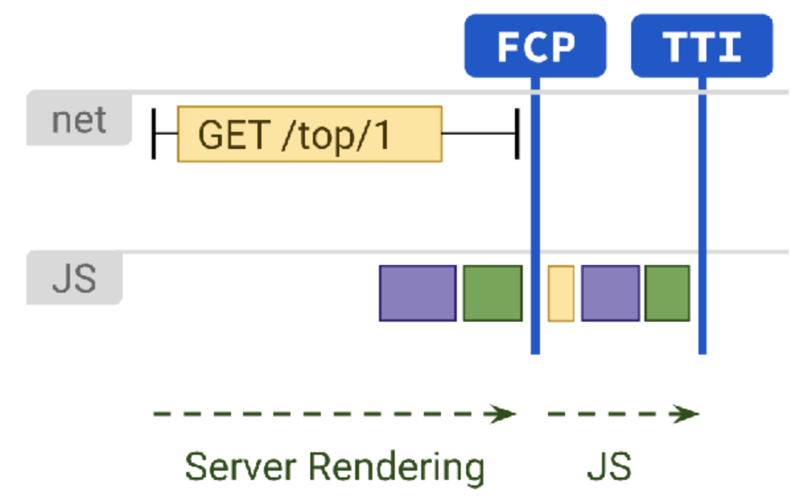
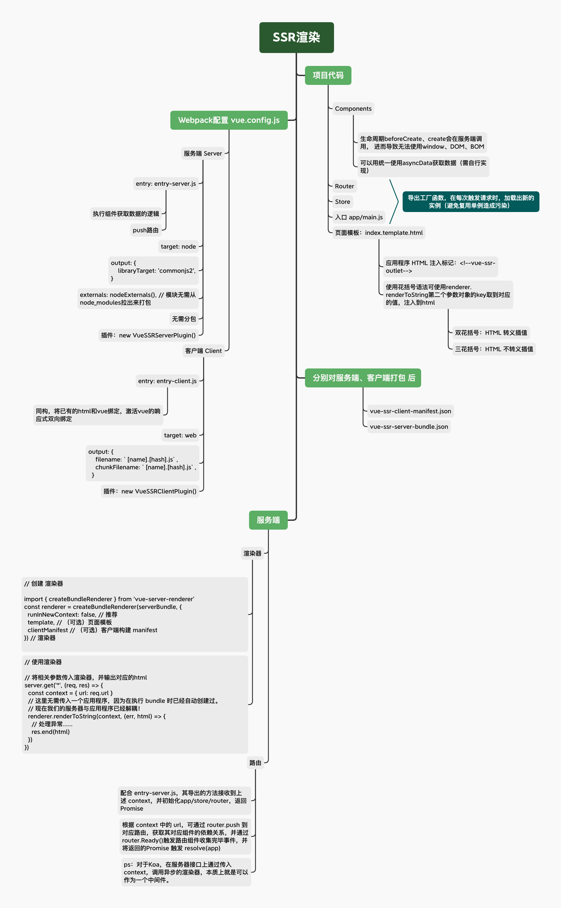
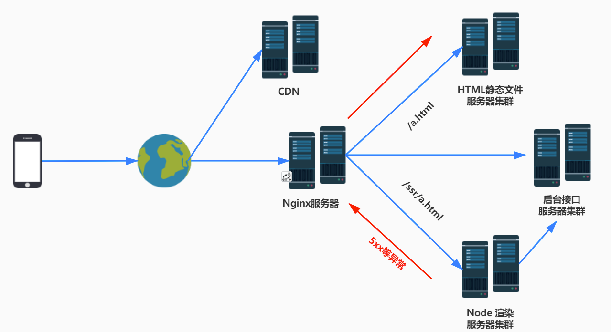

# Vue-SSR

## 笔记

1. SSR 直出 有内容的html（SEO），而 CSR 直返回静态的空html（通常只有 `#app`、`script` 标签）

2. 每次都通过 `createRouter` 创建 `new Router` 实例

3. 每次都通过 `createApp` 创建 `new Vue` 实例

4. `entry-server.js`

   ```js
   import createApp from './app'
   
   export default context => {
     return new Promise((resolve,reject) => {
       const { app, router } = createApp()
       
       router.push(context.url)
       router.onReady(() => {
         resolve(app)
       }, reject)
     })
   }
   ```

5. `enter-client.js`

   ```js
   import createApp from './app'
   
   const { app, router } = createApp()
   router.onReady(() => {
     app.$mount('#app')
   })
   ```

6. webpack 配置

   ```js
   // webpack插件
   const VueSSRServerPlugin = require("vue-server-renderer/server-plugin");
   const VueSSRClientPlugin = require("vue-server-renderer/client-plugin");
   const nodeExternals = require("webpack-node-externals");
   const merge = require("lodash.merge");
   
   // 环境变量：决定入口是客户端还是服务端
   const TARGET_NODE = process.env.WEBPACK_TARGET === "node";
   const target = TARGET_NODE ? "server" : "client";
   
   module.exports = {
     css: {
       extract: false
     },
     outputDir: './dist/'+target,
     configureWebpack: () => ({
       // 将 entry 指向应用程序的 server / client 文件
       entry: `./src/entry-${target}.js`,
       // 对 bundle renderer 提供 source map 支持
       devtool: 'source-map',
       // 这允许 webpack 以 Node 适用方式处理动态导入(dynamic import)，
       // 并且还会在编译 Vue 组件时告知 `vue-loader` 输送面向服务器代码(server-oriented code)。
       target: TARGET_NODE ? "node" : "web",
       node: TARGET_NODE ? undefined : false,
       output: {
         // 此处告知 server bundle 使用 Node 风格导出模块
         libraryTarget: TARGET_NODE ? "commonjs2" : undefined
       },
       // 外置化应用程序依赖模块。可以使服务器构建速度更快，并生成较小的 bundle 文件。
       externals: TARGET_NODE
         ? nodeExternals({
             // 不要外置化 webpack 需要处理的依赖模块。
             // 可以在这里添加更多的文件类型。例如，未处理 *.vue 原始文件，
             // 你还应该将修改 `global`（例如 polyfill）的依赖模块列入白名单
             whitelist: [/\.css$/]
           })
         : undefined,
       optimization: {
         splitChunks: undefined
       },
       // 这是将服务器的整个输出构建为单个 JSON 文件的插件。
       // 服务端默认文件名为 `vue-ssr-server-bundle.json`
       plugins: [TARGET_NODE ? new VueSSRServerPlugin() : new VueSSRClientPlugin()]
     }),
     chainWebpack: config => {
       config.module
         .rule("vue")
         .use("vue-loader")
         .tap(options => {
           merge(options, {
             optimizeSSR: false
           });
         });
     }
   };
   ```

7. 打包脚本

    ```json
    {
      "build:client": "cross-env BUILD_ENV=client vue-cli-service build",
      "build:server": "cross-env BUILD_ENV=server vue-cli-service build --no-clean"
      "build": "npm run build:server && npm run build:client"
    }
    ```

   

## SSR 和 CSR 的区别



### 基本认识

- 客户端渲染（Client Side Render：由客户端获取静态html/js后，再通过ajax进行二次请求获取数据）

- 服务端渲染（Server Side Render：由服务端渲染、拼接html，并直接返回），与CSR对比：

  - 优点

  1. 有利于SEO（爬虫能爬到有内容的html）

  2. 缩短内容到达时间，有效减少**FCP**(首屏渲染)/**TTI**(可交互)耗时（html直出内容，不用等待ajax请求，再填充数据进行渲染）

  3. 不依赖客户端环境，服务端渲染同样能够保障与最优用户环境（Wi-Fi 网络、高端设备）下相近的内容加载体验

  - 缺点

  1. 开发条件所限（生命周期再 `beforeCreate` 和 `created` 不能操作 `window` 、 `DOM` 、 `BOM`、`setTimeout` 等，对部分库需要做额外的支持）

  2. 涉及构建设置和部署的更多要求（需要 `node` 环境）

  3. 增加服务器端负载


### SSR 开发差异

- 源码需要服务端入口（数据获取、数据绑定）、客户端入口（激活、挂载、路由），作为 webpack 配置
- 为每个请求创建应用实例（ `app` / `router` / `store` ）
- node服务端使用 `vue-server-renderer`提供的渲染器，传入  `vue-ssr-client-manifest.js` 、 `vue-ssr-server-bundle.json` 及 执行`asyncData`将注入到vuex的数据 即可返回 html。

### 场景

无论首屏加载性能还是可访问性，都是对**内容密集型**页面才有意义，而对于交互密集型的页面，SSR 所能提前渲染的内容不多，对用户意义不大，SEO 的必要性也值得商榷。

因此，**SSR 适用于偏静态的内容展示场景**；**CSR适用于交互密集的页面，及非公开页**。如：商城首页、商品详情这种首屏加载速度直接影响曝光率、点击率、留存率的适用SSR，而商城的下单页、订单页、地址管理、优惠券等适用CSR。

另外，大多时候不一定非要 100% SSR，渲染特定页面，甚至只渲染个页面框架也是不错的。

## SSR 路由的实现

> 常规CSR的SPA应用，是通过监听url、hash变化，按需加载js、ajax实现切换组件，达到切换页面的效果。

1. 发起不同的请求连接，node 获取 context.url ，与 router 匹配，并获取到匹配的组件进行操作（数据预处理）。

   > 底层会根据 `vue-ssr-client-manifest.js` 匹配，并读取所需组件

   ```js
   // 对于 entry-server.js
   router.push(context.url)
   router.onReady(() => {
     const matchedComponents = router.getMatchedComponents();
     // 批量对数组操作 ...
     // 更新 store
   })
   ```

2. 根据组件、store、模板页（index.html），即可渲染出`html`

## SSR渲染过程文档

Vue-SSR 架构图：


Vue-SSR 渲染过程：



## SSR 降级



### 降级策略

1. 条件降级
   - 高流量时段
   - 发版
   - 人为设定（平台）
2. 异常降级
   - 服务器负载过高
   - SSR渲染异常
   - 未知错误

### 降级方案

1. CSR打包配置：注入 `mixins` ，判断没有 `window.__INITIAL_STATE__` 时，执行 `asyncData` 请求。

2. 服务端配置：

   ```js
     if(/**与需要降级为ssr的相关 url参数、err异常错误、获取全局配置文件...条件*/){
        res.end(csrTemplate)
        return
     }
     // 将Vue实例渲染为字符串，传入上下文对象。
     renderer.renderToString(context, (err, html) => {
       if (err) {
         // 偶发性错误避免抛500错误  可以降级为csr的html文件
         //打日志操作.....
         res.end(csrTemplate)
         return
       }
       res.end(html)
     })
   ```

3. Nginx 配置监控异常错误，将未知错误码重定向至CSR打包的静态资源。
