# 从零开始教你用 Docker 部署 Jenkins，为你的项目实现CI/CD

本文适合尚未了解 Docker 或 Jenkins 的人群，将介绍如何使用 Docker 搭建Gilab代码仓库和Jenkins，并以前端项目、Gitlab作为代码仓库为例，实现开发人员提交代码后，根据不同分支，自动构建项目，并部署至对应环境。实际上任何项目、任意主流代码仓库（如：gitlab、github、gitee、bitbucket等）皆可。
​
阅读本文，只需要你

- 会使用百度（or Google）和 git 克隆、提交代码，
- 了解 Web前端 的部署，是将 html 上传至 nginx 映射的目录
- 了解 linux 常用操作（如：`cd、ls、cat、echo、ssh` 等 ）即可

## 什么是CI/CD，Jenkins能做什么

实际开发中，经常会出现多分支并行开发，并需部署至多个环境，如果这些操作都有专人或者开发人员自己处理，那毫无疑问是巨大、且重复的工作量。在程序员的世界，重复的工作东西就应该自动化 ，而 Jenkins 就是为 **持续构建（持续集成，CI）** 、 **持续部署（持续交付，CD）** 的 **自动化、可视化** 操作提供解决方案。
​

通俗的说，整个流程通过 【git仓库通过提交代码触发Hook通知Jenkins】或者【Jenkins 轮询扫描检查更新】等...，触发相关任务或流水线的脚本的执行。而 Jenkins 仅作为触发器、可视化的工具，相关的构建、部署都需要自行通过脚本实现。如：shell、nodejs、python 等。

## 为什么用到了 Docker

Docker 可以理解为 linux 的虚拟机管理工具，可以方便、快速的创建一个虚拟机（更准确是叫 **容器**：Docker Container），如 Alpine Linux 仅有5mb大小。
​

将代码和一些服务，跑在同一个版本的容器中，可以 **确保环境一致** ，而不受硬件、机器本身操作系统影响，这在服务器迁移、分布式部署、构建等场景非常有用。换句话说，通过容器跑的项目， **可以迁移、部署任意一台安装了 Docker 服务器上** ，而几乎没有风险，只需要拉取同样的容器即可。
​

Docker 既然如此重要，很有必要先简单的了解一下：（自行搜索适合自己系统安装 Docker 的方式）

### Docker 基本概念

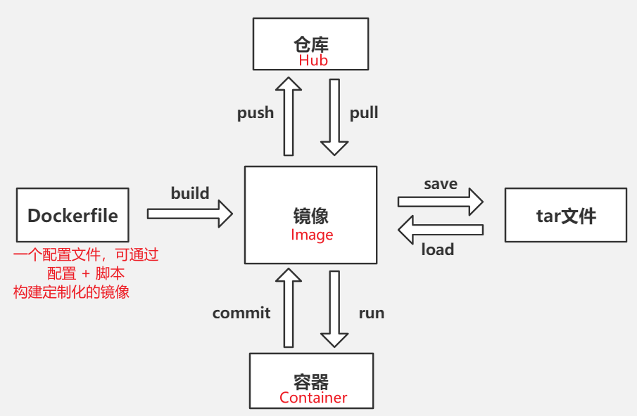

- 宿主机从仓库 pull 一个镜像，然后 run 起来，就是一个容器（虚拟机）了
- 进入容器一顿操作后，可以通过 commit 将更改留在镜像，否则容器停止后更改不会保留
- 镜像可以 save 出一个文件，方便迁移
- Dockerfile 可以仅用一个文件配置的方式来定制出一个镜像，而tag文件则是一个完整的操作系统了。

> docker 默认连接的官方仓库是 [https://hub.docker.com/](https://hub.docker.com/) ，可以进入搜索 alpine 试试。

### Docker 基本操作

拉取镜像 -> 创建容器 -> 进入容器 -> 操作容器  -> 删除容器 -> 删除镜像

```bash
# 拉取 nginx:alpine 镜像，不带版本号默认latest最新版本，实际项目上强烈建议固定版本
$ docker pull nginx:alpine
# 查看当前有哪些镜像（可以查看 IMAGE_ID 等）
$ docker images
# 将镜像运行为容器
# -d 后台运行
# -p 8080:80 端口映射（port），前者为宿主机端口，后者为容器端口
$ docker run -d -p 8080:80 nginx

# 此时宿主机 8080 端口已经可以查看到 👉 nginx 的欢迎页。

# 查看运行镜像（可以查看 CONTAINER_ID 、CONTAINER_NAME 等）
$ docker ps
# 可以再次运行，即镜像创建第二个容器（实例，运行与第一个相互隔离，且独立的系统）
# 自己准备一个 index.html 文件，然后将其目录与下方的 “/YOUR_HTML_DIR” 替换
# -v /YOUR_HTML_DIR:/usr/share/nginx/html 目录映射（volume），前者为宿主机目录，后者为容器目录
# --name my_html_nginx 给容器起个名字，可用来代替 CONTAINER_ID
# 当然，8080 端口被占用了，这里用 8081 端口。
$ docker run -d -p 8081:80 nginx -v /YOUR_HTML_DIR:/usr/share/nginx/html --name my_html_nginx

# 此时宿主机 8081 端口已经可以查看到 👉 自己准备的 html 文件

# 进入容器
# my_html_nginx 为 CONTAINER_NAME
# 也可以用 CONTAINER_ID, 使用任意能唯一匹配的长度即可
$ docker exec -it my_html_nginx sh
# 可以 `cd /usr/share/nginx/html` 看看自己的html文件
# 当然也可以通过 vi 修改 html 文件
# 退出容器
$ exit

# 删除容器
$ docker rm -f /*CONTAINER_ID*/
# 删除镜像
$ docker rmi -f /*IMAGE_ID*/
```

如果要求容器需要自带一些自己定制的一些工具和配置，此时建议使用 `Dockerfile` 来定制构建镜像，下面举个简单的例子，感兴趣的可以去搜索相关语法。

```dockerfile
FROM nginx:alpine
VOLUME ["/YOUR_HTML_DIR","/usr/share/nginx/html"]
# build 出镜像后，run 时，仍需 -p 指定端口映射
EXPOSE 8081
```

将该 Dockerfile 写入到一个空目录。并 `cd` 到该目录 ，执行： `docker build -t name1:tag1 .`（注意后面有个点），就可以通过 `docker images` 查看到构建出的 镜像。

### Docker Compose

可以通过 `docker run` 跑起容器，需要大量配置参数支撑，都写成命令参数可读性非常差。此外，容器间相互通信也将成为障碍。

> 1. 为什么会有障碍？
>
> 答：Docker 网卡会为每个容器分配一个内网 ip，但是容器之间并不知道对方会被分配到什么 ip
> ​
>
> 2. 上述_ Docker 基本操作 _中，第二个启动的 `my_html_nginx` 容器，能通过 `127.0.0.1:8080` 访问到第一个启动的容器吗？
>
> 答：不能，`127.0.0.1` 指向容器本身，而非宿主机，应该通过docker **内网 ip** 访问其 **本身的端口**，如 `172.17.0.2:80` ，而不是 外部的 8080。
> ​
>
> 3. 怎么查看容器的被分配的内网 ip？
>
> 答：`ifconfig` or  查看hosts `cat /etc/hosts`

那么容器与容器之间怎么通信呢？

1. 手动查看每个容器 ip，修改每个容器 hosts【非常不实用】
2. 使用 `--link`，但只能单向通信：`run` 时使用 `--link /* CONTAINER_ID:HOST_NAME */` ，在这个刚起的容器内，可以通过 HOST_NAME 访问该 CONTAINER_ID 的容器，而该 CONTAINER_ID 容器，无法访问到这个刚起的容器。【非常不实用】
3. 通过 docker-compose 编排容器，是通过一个 yml 文件，就能运行多个容器的神器。其会自动的将定义容器的 `key` 值，作为每个容器的域名映射。当然了，docker-compose 需自行搜索安装方式。

下面举个简单的例子，`nginx01` 和 `nginx02` 作为容器的 `key` 值。

```yaml
version: "3"
services:
  nginx01:
    container_name: mynginx01
    image: nginx:alpine
    ports:
      - 8080:80
  nginx02:
    container_name: mynginx02
    image: nginx:alpine
    ports:
      - 8081:80
```

```bash
# 将上述配置保存为 docker-compose.yml 文件，并cd到该目录
# 启动 docker-compose ，up 启动，-d 是后台运行
$ docker-compose up -d
# 进入容器 mynginx02
$ docker exec -it mynginx02 sh
# 如果没有 curl ，则执行 apk add curl
# 如果有就尝试连接一下
# 可以看到返回一个 nginx01 的欢迎页
$ curl nginx02:80
# 注意不是 8080
```
​
到此，相信你已经基本会使用 Docker、docker-compose 了，下面回到主题

## 硬件环境

理论上，需要三台服务器。但因为笔者资金有限，仅有一台电脑，通过三个 Docker 容器（虚拟机），代替三台服务器
三台服务器的作用是分别部署：

- gitlab：代码仓库
- jenkins：主流的 CI/CD 工具
- nginx：作为项目部署的服务器，此处用不同目录代表不同环境（模拟实际项目上，不同环境对应不同服务器）。

笔者电脑：win10 20H2 wsl2 Ubuntu 20.04.2 LTS、Docker version 20.10.6、docker-compose version 1.29.2（硬件要求：内存16g以上，其余环境只要有了docker，就无所谓了）

## 部署 gitlab、jenkins、nginx

### 部署脚本

使用docker，分别创建三台服务器，并且这三台服务器之间还需要通信，所以用到 docker-compose 来编排容器。（如果你有三台服务器，则可分开部署，通过服务器之间通过内网ip访问即可）

创建脚本如下：

```bash
version: "3"
services:
  nginx:
    container_name: mynginx
    image: nginx:alpine
    ports:
      - 80:80
      - "8022:22"
    volumes:
      - /home/vito/project:/usr/share/nginx/html
      - /home/vito/docker_nginx_data/log:/var/log/nginx
      # 按需配置，如果你了解 nginx 的话
      # - /home/vito/docker_nginx_data/nginx.conf:/etc/nginx/nginx.conf
      # - /home/vito/docker_nginx_data/conf.d/default.conf:/etc/nginx/conf.d/default.conf
    command:
      - /bin/sh
      - -c
      - |
        echo "http://mirrors.aliyun.com/alpine/v3.8/main/" > /etc/apk/repositories
        echo "http://mirrors.aliyun.com/alpine/v3.8/community/" >> /etc/apk/repositories
        apk update
        apk add --no-cache openssh openrc tzdata
        cp /usr/share/zoneinfo/Asia/Shanghai /etc/localtime
        sed -i "s/#PermitRootLogin.*/PermitRootLogin yes/g" /etc/ssh/sshd_config
        mkdir -p /root/.ssh && chmod 700 /root/.ssh/
        ssh-keygen -A
        echo "root:root" | chpasswd
        apk del tzdata
        rm -rf /var/cache/apk/*
        /usr/sbin/sshd
        nginx
        nginx -s reload
        tail -f /dev/null
  gitlab:
    container_name: mygitlab
    image: gitlab/gitlab-ce:latest
    ports:
      - 6490:80
      - 6492:443
    privileged: true
    volumes:
      - /home/vito/docker_gitlab_data/etc:/etc/gitlab
      - /home/vito/docker_gitlab_data/log:/var/log/gitlab
      - /home/vito/docker_gitlab_data/opt:/var/opt/gitlab
  jenkins:
    container_name: myjenkins
    image: jenkins/jenkins:lts
    ports:
      - 6480:8080
      - 6481:50000
      - 6482:45000
    volumes:
      - /home/vito/docker_jenkins_data:/var/jenkins_home
```

保存为 `docker-compose.yml` 文件，通过 `docker-compose up -d` 启动。
**注意**：

1. `8022:22` 需要加上引号，不然和yml语法有冲突
1. nginx command 会覆盖原命令，所以在安装、运行ssh后，还需要重启nginx
1. 安装ssh，明文在脚本写了"root:root" (用户名:密码)，虽然不太对，但这里仅用来学习，且作为测试环境服务器

### 部署结果

项目分别部署在（根据端口映射，且需要在宿主机补充一个页面，/home/vito/project/k/index.html）：

- Ngnix 前端项目：[http://127.0.0.1/k/index.html](http://127.0.0.1/k/index.html)
- Gitlab: [http://127.0.0.1:6490](http://127.0.0.1:6490)
- Jenkins: [http://127.0.0.1:6480](http://127.0.0.1:6480)

## 初始化 gitlab、jenkins、nginx

打开 Gitlab、Jenkins 瞧一瞧，该设密码就设密码，该创建账户就创建，根据 UI 提示操作即可。
这里需要**注意**

- gitlab初始账户名称是：root
- jenkins安装 **推荐插件**

### gitlab

#### 初始化项目代码

此处需要您创建了一个 test-vite 的项目：`ssh://git@127.0.*.*:***/test/test-vite.git`

并通过 `yarn create @vitejs/app` 初始化了前端代码

#### webhook请求配置

使用root账户进行设置（如果你将gitlab部署到另一台服务器，这里就可以略过了）：

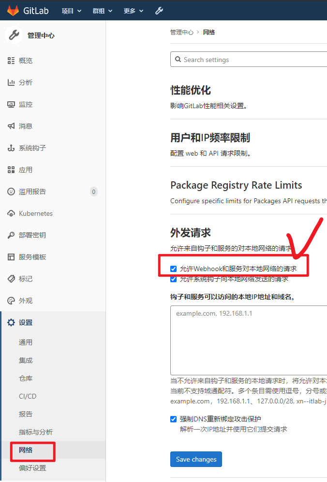
​
### jenkins

#### 插件安装

手动搜索安装：

- gitlab
- nodejs

#### 系统设置

系统设置 - 系统配置

- **取消打勾 Gitlab：Enable authentication for '/project' end-point**

系统设置 - 全局工具配置

- **安装Nodejs。Global npm packages to install 此处可以填写 yarn（根据项目来，也可以不填，手动通过npm安装）**

#### 配置 gitlab 拉取代码权限认证

当然了，此时的 jenkins 肯定是匿名，没有权限拉取代码的。分别给 jenkins、gitlab 配个 ssh 私钥、公钥即可。

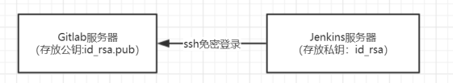

#### 生成公钥、私钥

进入jenkins容器，使用root账号生成：`ssh-keygen -t rsa`

一路回车，进入提示的目录就可以看到，两个文件：

- id_rsa 私钥
- id_rsa.pub 公钥

分别 `cat` 出来，并复制。

##### 配置公钥

gitlab -> 头像 -> preferences -> ssh 密钥 -> 粘贴公钥 -> 添加密钥

##### 配置私钥

jenkins -> 系统管理 -> 凭据管理（Manage Credentails，不是凭据配置） -> 添加全局凭据 -> 选择 SSH... -> 如图

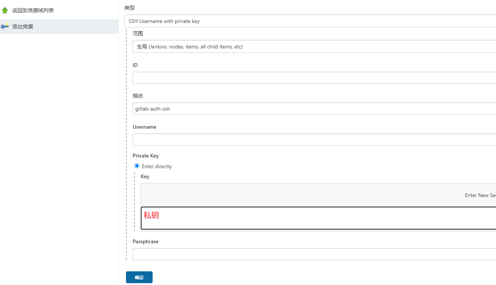

#### 配置 nginx 推送文件的 ssh 免密

用于 jenkins 执行推送文件脚本，同步文件到nginx服务器上。

```bash
# 进入jenkins
docker exec -it myjenkins sh

# 进入后

# 1、生成公钥、私钥
#    一路回车
ssh-keygen

# 2、添加公钥，这里需要输入ngnix服务器的密码，就是上方脚本里头的root:root，前者为用户名，后者为密码。
ssh-copy-id -i ~/.ssh/id_rsa.pub root@nginx

# 完成免密，测试
ssh root@nginx
```

> 补充知识：ssh默认会连22端口，对于本来就暴露22端口的nginx容器来说无需配置，而对于外部的宿主机就需要指定映射的端口：`ssh root@127.0.0.1 -p8022`

## 实现 CI/CD

下面介绍Jenkins创建项目中最常用的两种方式，其中主流还是 pipeline。

### 方式1：通过 Jenkins Freestyle

自由风格非常简单：jenkins提供一个工作空间，通过ui配置shell

#### 源码配置：

- 源码地址ip需替换为映射地址
- Credentials 凭证，选取刚刚配置好的

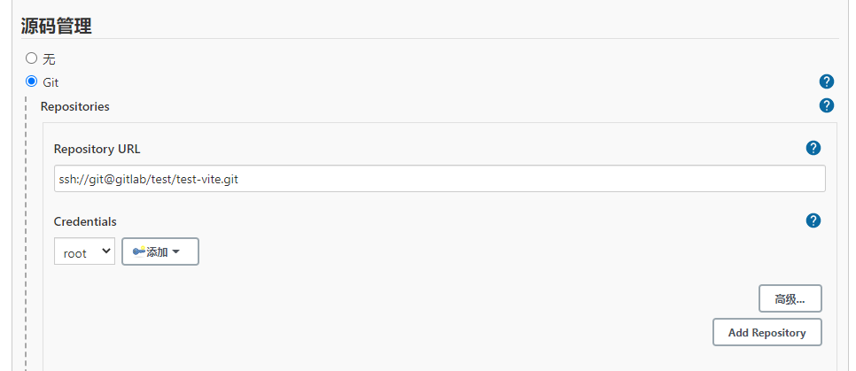

#### 构建触发器（配合webHook）：

生成hook密钥，此时需要复制出：第一个红框的项目地址，以及生成的token。

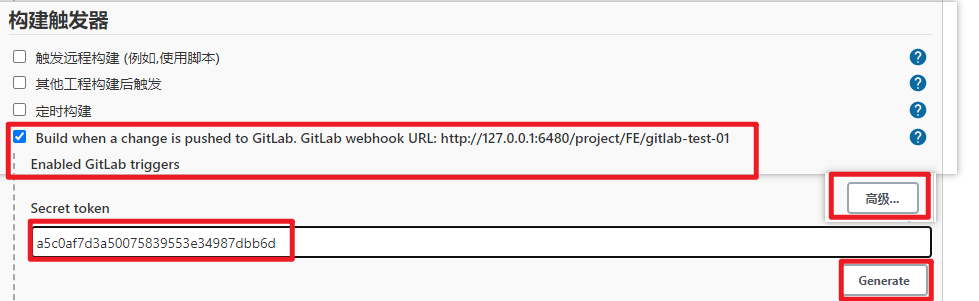

进入Gitlab test-vite 项目中：

**注意**：项目地址ip需替换为映射地址：http://jenkins:8080/project/FE/gitlab-test-01

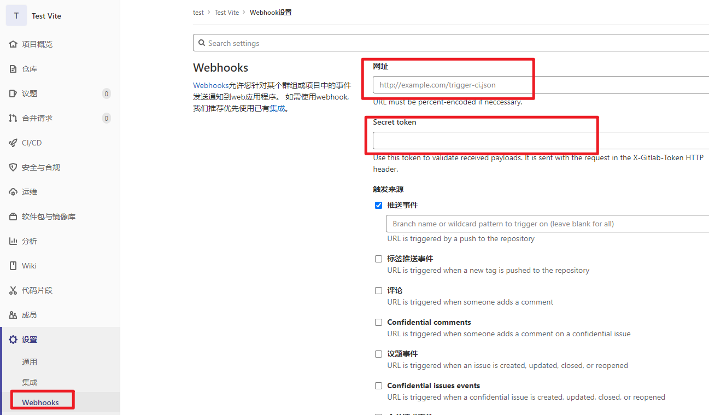

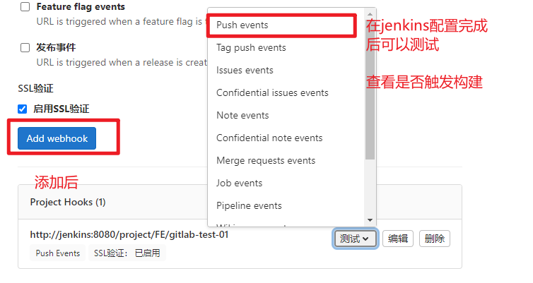

#### 构建环境

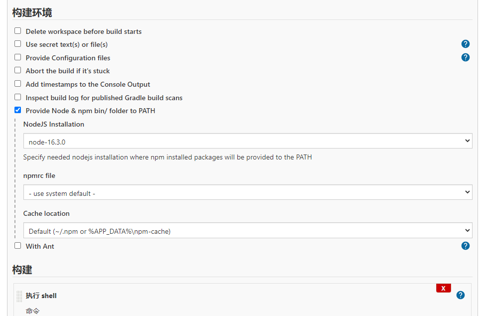

#### 构建脚本

```bash
# 注入 ci 构建环境 JSON
echo "{" > ./build-env.json
echo '"GIT_BRANCH":"' >> ./build-env.json
echo $GIT_BRANCH >> ./build-env.json
echo '","GIT_COMMIT":"' >> ./build-env.json
echo $GIT_COMMIT >> ./build-env.json
echo '","GIT_COMMITTER_NAME":"' >> ./build-env.json
echo $GIT_COMMITTER_NAME >> ./build-env.json
echo '","GIT_URL":"' >> ./build-env.json
echo $GIT_URL >> ./build-env.json
echo '"}' >> ./build-env.json
sed -i ":a;N;s/\n//g;ta" ./build-env.json

# 分支名 提取环境
# ***/master -> master
# ***/k.*** -> k
var=${GIT_BRANCH##*/}
var=${var%%.*}
echo "推送至环境：$var"

# 构建
yarn
yarn build

# 推送文件
server="root@nginx"
targetDir="/usr/share/nginx/html/$var"

ssh "$server" "mkdir -p $targetDir"
scp -r ./dist/* "$server:$targetDir"
```

### 方式2：通过 Jenkins Pipeline

pipeline比较灵活

- 可以指定节点（代理），构建项目
- 可以有多个工作空间
- 可以通过将脚本写在Jenkinsfile文件，和代码一起管理
- 可以分步骤写ci/cd过程，并提供可视化，方便定位问题
- ...

#### 构建触发器（配合 webHook ）

同自由风格

#### 流水线

脚本路径不建议修改，默认根目录下的 Jenkinsfile 就好。

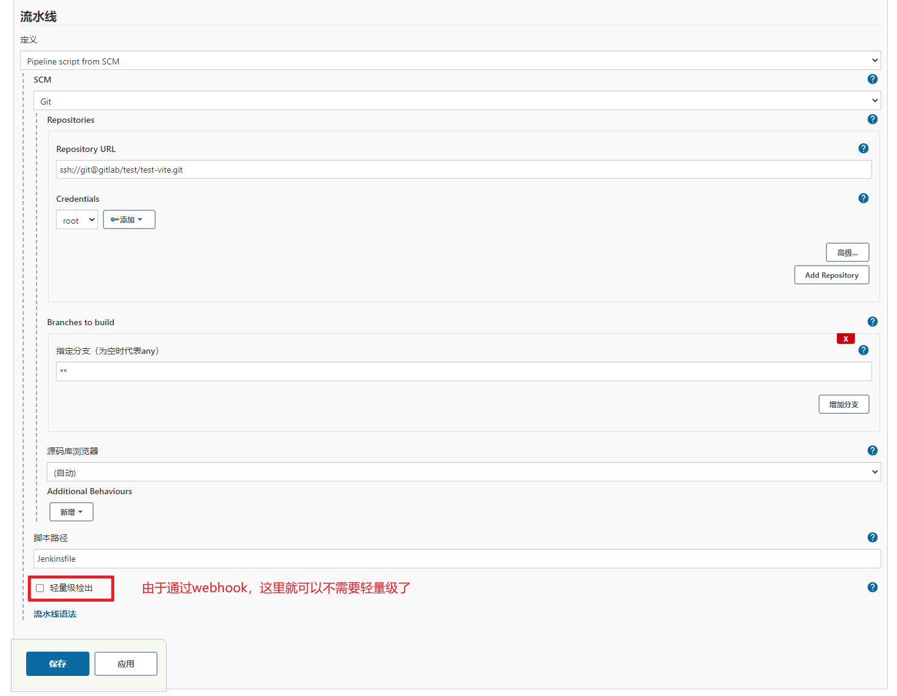

#### 编写 Jenkinsfile

在根目录创建该文件，并填写如下脚本。

为方便读者阅读和理解，该脚本做未拆分，且 buildEnv 为几乎所有的环境变量，实际按需引用即可。

```groovy
def buildEnv = '{}'
def deployEnv = 'k'

pipeline {

  agent any

  stages {
    stage('PatchEnv') {
      steps {
        script {
          buildEnv = """
          {
            \"BRANCH_NAME\":\"$env.BRANCH_NAME\",
            \"BRANCH_IS_PRIMARY\":\"$env.BRANCH_IS_PRIMARY\",
            \"CHANGE_ID\":\"$env.CHANGE_ID\",
            \"CHANGE_URL\":\"$env.CHANGE_URL\",
            \"CHANGE_TITLE\":\"$env.CHANGE_TITLE\",
            \"CHANGE_AUTHOR\":\"$env.CHANGE_AUTHOR\",
            \"CHANGE_AUTHOR_DISPLAY_NAME\":\"$env.CHANGE_AUTHOR_DISPLAY_NAME\",
            \"CHANGE_AUTHOR_EMAIL\":\"$env.CHANGE_AUTHOR_EMAIL\",
            \"CHANGE_TARGET\":\"$env.CHANGE_TARGET\",
            \"CHANGE_BRANCH\":\"$env.CHANGE_BRANCH\",
            \"CHANGE_FORK\":\"$env.CHANGE_FORK\",
            \"TAG_NAME\":\"$env.TAG_NAME\",
            \"TAG_TIMESTAMP\":\"$env.TAG_TIMESTAMP\",
            \"TAG_UNIXTIME\":\"$env.TAG_UNIXTIME\",
            \"TAG_DATE\":\"$env.TAG_DATE\",
            \"CI\":\"$env.CI\",
            \"BUILD_NUMBER\":\"$env.BUILD_NUMBER\",
            \"BUILD_ID\":\"$env.BUILD_ID\",
            \"BUILD_DISPLAY_NAME\":\"$env.BUILD_DISPLAY_NAME\",
            \"JOB_NAME\":\"$env.JOB_NAME\",
            \"JOB_BASE_NAME\":\"$env.JOB_BASE_NAME\",
            \"BUILD_TAG\":\"$env.BUILD_TAG\",
            \"EXECUTOR_NUMBER\":\"$env.EXECUTOR_NUMBER\",
            \"NODE_NAME\":\"$env.NODE_NAME\",
            \"NODE_LABELS\":\"$env.NODE_LABELS\",
            \"WORKSPACE\":\"$env.WORKSPACE\",
            \"WORKSPACE_TMP\":\"$env.WORKSPACE_TMP\",
            \"JENKINS_HOME\":\"$env.JENKINS_HOME\",
            \"JENKINS_URL\":\"$env.JENKINS_URL\",
            \"BUILD_URL\":\"$env.BUILD_URL\",
            \"JOB_URL\":\"$env.JOB_URL\",
            \"GIT_COMMIT\":\"$env.GIT_COMMIT\",
            \"GIT_PREVIOUS_COMMIT\":\"$env.GIT_PREVIOUS_COMMIT\",
            \"GIT_PREVIOUS_SUCCESSFUL_COMMIT\":\"$env.GIT_PREVIOUS_SUCCESSFUL_COMMIT\",
            \"GIT_BRANCH\":\"$env.GIT_BRANCH\",
            \"GIT_LOCAL_BRANCH\":\"$env.GIT_LOCAL_BRANCH\",
            \"GIT_CHECKOUT_DIR\":\"$env.GIT_CHECKOUT_DIR\",
            \"GIT_URL\":\"$env.GIT_URL\",
            \"GIT_COMMITTER_NAME\":\"$env.GIT_COMMITTER_NAME\",
            \"GIT_AUTHOR_NAME\":\"$env.GIT_AUTHOR_NAME\",
            \"GIT_COMMITTER_EMAIL\":\"$env.GIT_COMMITTER_EMAIL\",
            \"GIT_AUTHOR_EMAIL\":\"$env.GIT_AUTHOR_EMAIL\"
          }
          """
          // 保留引号的转义字符
          buildEnv = buildEnv.replaceAll(/"/, '\\\\"')
          deployEnv = env.GIT_BRANCH.replaceAll(/^.*\//, '').replaceAll(/\..*$/, '')
        }
        echo "构建环境：$buildEnv"
        echo "部署环境：$deployEnv"
        sh """
          # 注入 ci 构建环境 JSON
          echo "$buildEnv" > ./build-env.json
        """
      }
    }
    stage('Build') {
      steps {
        nodejs('node-16.3.0') {
          sh """
            # 构建
            yarn
            yarn build
          """
        }
      }
    }
    stage('Deploy') {
      steps {
        sh """
          # 推送文件
          server="root@nginx"
          targetDir="/usr/share/nginx/html/$deployEnv"

          echo "部署目录："
          echo \$targetDir

          ssh "\$server" "mkdir -p \$targetDir"
          scp -r ./dist/* "\$server:\$targetDir"
        """
      }
    }
  }
}
```

#### Jenkinsfile 编写建议：

- 不要在 Jenkinsfile 写太多或复杂的脚本。可以通过拆分为外部 .sh 文件，来执行
- 不要将脚本揉成一团，写在一起。配合 Jenkinsfile ，拆分 stage、step ，以达到可视化的效果，如下图所示

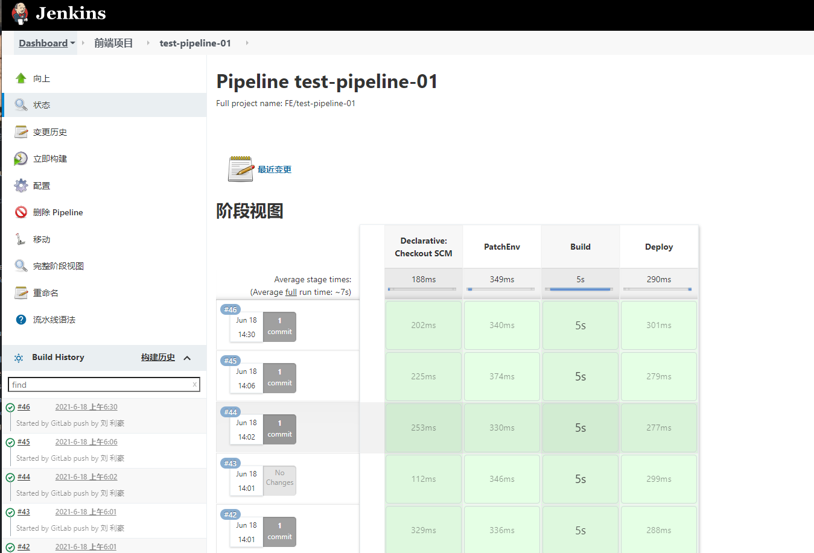

## 结束语

通过阅读本文，相信你已经基本了解 Docker，并清楚 Jenkins 的运作流程，其无非就是通过 hook 或者 轮询，触发脚本。事实上 Jenkins 确实就是这样一个“小工具”，更多的还是需要靠自己编写脚本实现各种需求。
​

如果你的团队每次更新代码还需要手动构建、部署，那么强烈建议用闲置的电脑，按照本文的操作实现 CI/CD ，让自己解放双手，聚焦其他更有意义的事情上。


最后，强烈建议继续阅读官方的两个最佳实践：


- pipeline 最佳实践：[https://www.jenkins.io/doc/book/pipeline/pipeline-best-practices/](https://www.jenkins.io/doc/book/pipeline/pipeline-best-practices/)
- 使用npm构建Node.js和React应用：[https://www.jenkins.io/zh/doc/tutorials/build-a-node-js-and-react-app-with-npm/](https://www.jenkins.io/zh/doc/tutorials/build-a-node-js-and-react-app-with-npm/)
