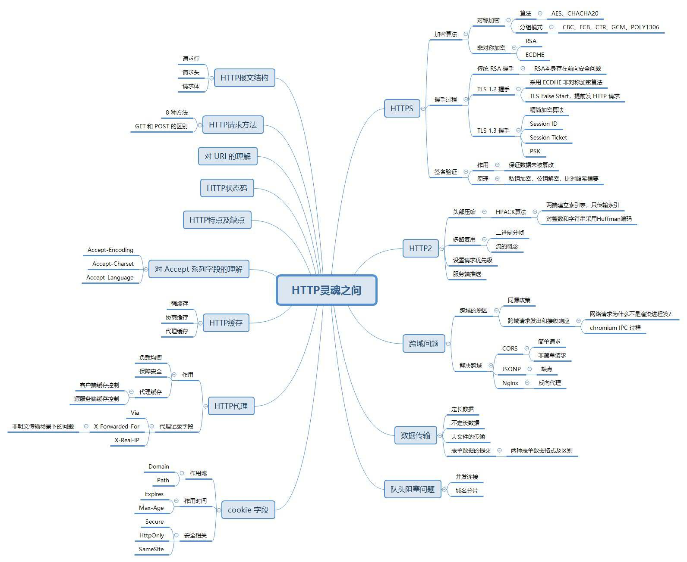

# HTTP体系

不多说，上脑图：



## 不得不提 TCP

左转见 TCP 文档。


## 报文结构

区分 **请求报文** 和 **响应报文**，但都符合如下结构：

```txt
起始行 + 头部 + 【空行】 + 实体
```

### 起始行

请求报文
```txt
GET /getInfo?id=66 HTTP/1.1
```

响应报文

```txt
HTTP/1.1 200 OK
```

### 头部

请求头的字段非常多，涉及到很多 http 的特性，大体格式：

- 字段名不区分大小写
- 字段名不允许出现空格，不可以出现下划线 `_`
- 字段名后面必须**紧接着 `:`**

所在位置：


### 空行

很重要，用来区分开 **头部** 和 **实体**。

问: 如果说在头部中间故意加一个空行会怎么样？

那么**空行后的内容全部被视为实体**。

### 实体

就是具体的数据了，也就是 `body` 部分。请求报文对应 **请求体**, 响应报文对应 **响应体**。

## 请求方法

HTTP1.0 定义了三种请求方法： GET, POST 和 HEAD方法。

HTTP1.1 新增了六种请求方法：OPTIONS、PUT、PATCH、DELETE、TRACE 和 CONNECT 方法。

| 序号 | 方法    | 描述                                                         |
| :--- | :------ | :----------------------------------------------------------- |
| 1*   | GET     | 请求指定的页面信息，并返回实体主体。                         |
| 2    | HEAD    | 类似于 GET 请求，只不过返回的响应中没有具体的内容，用于获取报头 |
| 3*   | POST    | 向指定资源提交数据进行处理请求（例如提交表单或者上传文件）。数据被包含在请求体中。POST 请求可能会导致新的资源的建立和/或已有资源的修改。 |
| 4*   | PUT     | 从客户端向服务器传送的数据取代指定的文档的内容。             |
| 5*   | DELETE  | 请求服务器删除指定的页面。                                   |
| 6    | CONNECT | HTTP/1.1 协议中预留给能够将连接改为管道方式的代理服务器。    |
| 7*   | OPTIONS | 允许客户端查看服务器的性能。                                 |
| 8    | TRACE   | 回显服务器收到的请求，主要用于测试或诊断。                   |
| 9*   | PATCH   | 是对 PUT 方法的补充，用来对已知资源进行局部更新 。           |

## `GET` 和 `POST` 有什么区别？

- 语义。
- 从**缓存**的角度，GET 请求会被浏览器主动缓存下来，留下历史记录，而 POST 默认不会。
- 从**编码**的角度，GET 只能进行 URL 编码，只能接收 ASCII 字符，而 POST 没有限制。
- 从**参数**的角度，GET 一般放在 URL 中，因此不安全，POST 放在请求体中，更适合传输敏感信息。
- 从**幂等性**的角度，`GET`是**幂等**的，而`POST`不是。(`幂等`表示执行相同的操作，结果也是相同的)
- 从**TCP**的角度，GET 请求会把请求报文一次性发出去，而 POST 会分为两个 TCP 数据包，首先发 header 部分，如果服务器响应 100(continue)， 然后发 body 部分。(**火狐**浏览器除外，它的 POST 请求只发一个 TCP 包)

## 如何理解 URI？

全称为(Uniform Resource Identifier), 也就是**统一资源标识符**

但是，它并不是我们常说的`网址`, 网址指的是`URL`, 实际上`URI`包含了`URN`和`URL`两个部分，由于 URL 过于普及，就默认将 URI 视为 URL 了。

### URI 的结构


* **scheme**: 表示协议名，比如`http`, `https`, `file`等等。后面必须和`://`连在一起。

* **user:passwd@**: 表示登录主机时的用户信息，不过很不安全，不推荐使用，也不常用。

* **host:port**: 表示主机名和端口。

* **path**: 表示请求路径，标记资源所在位置。

* **query**: 表示查询参数，为`key=val`这种形式，多个键值对之间用`&`隔开。

* **fragment**: 表示 URI 所定位的资源内的一个**锚点**，浏览器可以根据这个锚点跳转到对应的位置。

举个例子：

```txt
https://www.baidu.com/s?wd=HTTP&rsv_spt=1
```

这个 URI 中，`https`即`scheme`部分，`www.baidu.com`为`host:port`部分（注意，http 和 https 的默认端口分别为80、443），`/s`为`path`部分，而`wd=HTTP&rsv_spt=1`就是`query`部分。

### URI 编码

URI 只能使用`ASCII`, ASCII 之外的字符是不支持显示的，而且还有一部分符号是界定符，如果不加以处理就会导致解析出错。

因此，URI 引入了`编码`机制，将所有**非 ASCII 码字符**和**界定符**转为十六进制字节值，然后在前面加个`%`。也就是我们在前端项目常用的 `encodeURI()` / `encodeURIComponent()` / `decodeURI()` / `decodeURIComponent()` 方法。

如，空格被转义成了`%20`。

## 比较HTTP 0.9和HTTP 1.0

1. HTTP 0.9只是一个简单的协议，只有一个GET方法，没有首部，目标用来获取HTML。
2. HTTP 1.0协议大量内容：首部，响应码，重定向，错误，条件请求，内容编码等。

## HTTP 1.1的改进

HTTP1.1 中浏览器再也不用为每个请求重新发起TCP连接( `connection: keep-alive` )了，增加内容有：

* 缓存相关头部的扩展

* OPTIONS方法

  用来查询针对请求URI指定的资源支持的方法

* Upgrade 头部

  切换到增强的协议类型，如 HTTP/2.0 或 WebSockets

* Range请求

  指定资源范围

* 压缩和传输编码

  gzip

* 管道化

  不用等待响应即可直接发送下一个请求

## HTTP特点

* **灵活可扩展**，主要体现在两个方面。一个是语义上的自由，只规定了基本格式，比如空格分隔单词，换行分隔字段，其他的各个部分都没有严格的语法限制。另一个是传输形式的多样性，不仅仅可以传输文本，还能传输图片、视频等任意数据，非常方便。

* **可靠传输**。HTTP 基于 TCP/IP，因此把这一特性继承了下来。这属于 TCP 的特性，不具体介绍了。

* **请求-应答**。也就是`一发一收`、`有来有回`， 当然这个请求方和应答方不单单指客户端和服务器之间，如果某台服务器作为代理来连接后端的服务端，那么这台服务器也会扮演**请求方**的角色。

* **无状态**。这里的状态是指**通信过程的上下文信息**，而每次 http 请求都是独立、无关的，默认不需要保留状态信息。

### HTTP缺点

* 明文传输

  即协议里的报文(主要指的是头部)不使用二进制数据，而是文本形式。

  这当然对于调试提供了便利，但同时也让 HTTP 的报文信息暴露给了外界，给攻击者也提供了便利。`WIFI陷阱`就是利用 HTTP 明文传输的缺点，诱导你连上热点，然后疯狂抓你所有的流量，从而拿到你的敏感信息。

* 队头阻塞

  当 http 开启长连接时，共用一个 TCP 连接，同一时刻只能处理一个请求，那么当前请求耗时过长的情况下，其它的请求只能处于阻塞状态，也就是著名的**队头阻塞**问题。接下来会有一小节讨论这个问题。

## Accept 系列字段

四个部分: **数据格式**、**压缩方式**、**支持语言**和**字符集**。


### 数据格式

接收端使用 `Accept` ，体现在 `Content-Type` 字段上。

取值如下：

* text： text/html, text/plain, text/css 等

* image: image/gif, image/jpeg, image/png 等

* audio/video: audio/mpeg, video/mp4 等

* application: application/json, application/javascript, application/pdf, application/octet-stream

### 压缩方式

接收端使用 `Accept-Encoding` ，体现在 `Content-Encoding` 字段上。

- gzip: 当今最流行的压缩格式
- deflate: 另外一种著名的压缩格式
- br: 一种专门为 HTTP 发明的压缩算法

### 支持语言

接收端使用 `Accept-Language` ，体现在 `Content-Language` 字段上。

```js
// 发送端
Content-Language: zh-CN, zh, en
// 接收端
Accept-Language: zh-CN, zh, en
```

### 字符集

接收端使用 `Accept-Charset` ，体现在 `Content-Type` 字段上。(注意没有 `Content-Charset` )

```js
// 发送端
Content-Type: text/html; charset=utf-8
// 接收端
Accept-Charset: charset=utf-8
```

## 处理大文件传输

如视频预览、大文件分块上传...

都是用的是 接收端：`Range`、发送端： `Content-Range`

### 告知客户端

首先服务端向客户端发送

```js
Accept-Ranges: none
```

用来告知客户端这边是支持范围请求的。

### 客户端发起

客户端发起指定范围的请求，格式如下：`bytes=x-y`

```js
// 单段数据
Range: bytes=0-9
// 30- 表示从30到终点
// -30 表示从起点到30
// 多段数据
Range: bytes=0-9, 30-39
```

### 服务端响应

服务器收到请求之后，首先验证范围**是否合法**，如果越界了那么返回`416`错误码，否则读取相应片段，返回`206`状态码。

## HTTP处理表单数据提交

主要体现在两种不同的 `Content-Type` 取值:

- `application/x-www-form-urlencoded`
  - 其中的数据会被编码成以`&`分隔的键值对
  - 字符以**URL编码方式**编码。
- `multipart/form-data`
  - 请求头中的`Content-Type`字段会包含`boundary`，且`boundary`的值有浏览器默认指定。例: `Content-Type: multipart/form-data;boundary=----WebkitFormBoundaryRRJKeWfHPGrS4LKe`。
  - 数据会分为多个部分，每两个部分之间通过分隔符来分隔，每部分表述均有 HTTP 头部描述子包体，如`Content-Type`，在最后的分隔符会加上`--`表示结束。

**总结**：

* `multipart/form-data` 格式最大的特点在于:**每一个表单元素都是独立的资源表述**。

* 对于图片等文件的上传，基本采用`multipart/form-data`，因为没必要对文件进行URL编码。

## HTTP1.1 如何解决 HTTP 队头阻塞问题

**为什么会造成队头阻塞？**

HTTP 传输是基于`请求-应答`的模式进行的，报文必须是一发一收，但值得注意的是，里面的任务被放在一个任务队列中串行执行，一旦队首的请求处理太慢，就会阻塞后面请求的处理。这就是著名的`HTTP队头阻塞`问题。

**解决方式：**

* 并发链接
	
	Chrome 中是 6 个。
	
* 域名分片

	一个域名不是可以并发 6 个长连接吗？那我就多分几个域名。（比如：c1.xx.com 、c2.xx.com。）

## Cookie 相关

Cookie 相当于为 HTTP 添加了状态。

### 作用域

关于作用域也有两个属性: **Domain**和**path**, 给 **Cookie** 绑定了域名和路径，在发送请求之前，发现域名或者路径和这两个属性不匹配，那么就不会带上 Cookie。值得注意的是，对于路径来说，`/`表示域名下的任意路径都允许使用 Cookie。

### 安全相关

如果带上`Secure`，说明只能通过 HTTPS 传输 cookie。

如果 cookie 字段带上`HttpOnly`，那么说明只能通过 HTTP 协议传输，不能通过 JS 访问，这也是预防 XSS 攻击的重要手段。

相应的，对于 CSRF 攻击的预防，也有`SameSite`属性。

`SameSite`可以设置为三个值，`Strict`、`Lax`和`None`。

- 在`Strict`模式下，浏览器完全禁止第三方请求携带Cookie。比如请求`sanyuan.com`网站只能在`sanyuan.com`域名当中请求才能携带 Cookie，在其他网站请求都不能。

- 在`Lax`模式，就宽松一点了，但是只能在 `get 方法提交表单`况或者`a 标签发送 get 请求`的情况下可以携带 Cookie，其他情况均不能。

- 在`None`模式下，也就是默认模式，请求会自动携带上 Cookie。

### Cookie 的缺点

1. 容量缺陷。Cookie 的体积上限只有`4KB`，只能用来存储少量的信息。
2. 性能缺陷。Cookie 紧跟域名，不管域名下面的某一个地址需不需要这个 Cookie ，请求都会携带上完整的 Cookie，这样随着请求数的增多，其实会造成巨大的性能浪费的，因为请求携带了很多不必要的内容。但可以通过`Domain`和`Path`指定**作用域**来解决。
3. 安全缺陷。由于 Cookie 以纯文本的形式在浏览器和服务器中传递，很容易被非法用户截获，然后进行一系列的篡改，在 Cookie 的有效期内重新发送给服务器，这是相当危险的。另外，在`HttpOnly`为 false 的情况下，Cookie 信息能直接通过 JS 脚本来读取。

## HTTP 代理

引入代理之后，作为代理的服务器相当于一个中间人的角色，对于客户端而言，表现为服务器进行响应；而对于源服务器，表现为客户端发起请求，具有**双重身份**。

### 功能

1. **负载均衡**。客户端的请求只会先到达代理服务器，后面到底有多少源服务器，IP 都是多少，客户端是不知道的。因此，这个代理服务器可以拿到这个请求之后，可以通过特定的算法分发给不同的源服务器，让各台源服务器的负载尽量平均。当然，这样的算法有很多，包括**随机算法**、**轮询**、**一致性hash**、**LRU**`(最近最少使用)`等等。
2. **保障安全**。利用**心跳**机制监控后台的服务器，一旦发现故障机就将其踢出集群。并且对于上下行的数据进行过滤，对非法 IP 限流，这些都是代理服务器的工作。
3. **缓存代理**。将内容缓存到代理服务器，使得客户端可以直接从代理服务器获得而不用到源服务器那里。下一节详细拆解。

### 相关头部

* `Via`

  标明身份，留下痕迹。如：`Via: proxy_server2, proxy_server1`

* `X-Forwarded-For`

  为谁转发，记录 **请求方** 的 `IP` 。

* `X-Real-IP`

  记录 **客户端** 的真实 `IP` 。
  
> X-Forwarded-For产生的问题：
> X-Forwarded-For这个字段记录的是请求方的 IP，这意味着每经过一个不同的代理，这个字段的名字都要变，从客户端到代理1，这个字段是客户端的 IP，从代理1到代理2，这个字段就变为了代理1的 IP。
> 1. 意味着代理必须解析 HTTP 请求头，然后修改，比直接转发数据性能下降。
> 2. 在 HTTPS 通信加密的过程中，原始报文是不允许修改的。
> 由此产生了 *代理协议*，一般使用明文版本，只需要在 HTTP 请求行上面加上这样格式的文本即可:
> ```js
> // PROXY + TCP4/TCP6 + 请求方地址 + 接收方地址 + 请求端口 + 接收端口
> PROXY TCP4 0.0.0.1 0.0.0.2 1111 2222
> GET / HTTP/1.1
> ...
> ```

### JSONP

利用标签的 `scr` 支持跨域的特性，来实现 `get` 请求。

## HTTPS安全在哪

HTTPS并不是一个新的协议, 它在`HTTP`和`TCP`的传输中建立了一个安全层，利用`对称加密`和`非对称机密`结合数字证书认证的方式，让传输过程的安全性大大提高。

在 HTTP 下面增加了一层 SSL/TLS 协议，简单的讲，**HTTPS = HTTP + SSL/TLS**。

大体流程：

1. 浏览器向服务器发送`client_random`和加密方法列表。
2. 服务器接收到，返回`server_random`、加密方法以及公钥。
3. 浏览器接收，接着生成另一个随机数`pre_random`, 并且用公钥加密，传给服务器。(敲黑板！重点操作！)
4. 服务器用公钥解密这个被加密后的`pre_random`。

现在浏览器和服务器有三样相同的凭证:`client_random`、`server_random`和`pre_random`。然后两者用相同的加密方法混合这三个随机数，生成最终的`密钥`。

然后浏览器和服务器尽管用一样的密钥进行通信，即使用`对称加密`。

这个最终的密钥是很难被中间人拿到的，为什么呢? 因为中间人没有私钥，从而**拿不到pre_random**，也就无法生成最终的密钥了。

回头比较一下和单纯的使用**非对称加密**, 这种方式做了什么改进呢？本质上是**防止了私钥加密的数据外传**。单独使用**非对称加密**，最大的漏洞在于服务器传数据给浏览器只能用`私钥`加密，这是危险产生的根源。利用`对称和非对称`加密结合的方式，就防止了这一点，从而保证了安全。

## HTTP2 的改进

性能提升：

* 头部压缩

  采用 **HPack算法** 对请求头压缩。（1、对请求头字段建哈希表，下次只需传输索引即可；2、对整数、字符串进行 **哈弗曼编码**）

* 多路复用

  把报文全部转为二进制格式（各个部分被拆分为xx帧，如：*Headers帧*），HTTP/2 用 **流** 来在一个 TCP 连接上来进行多个数据帧的通信（在服务端会重新组装）。通过其他字段还实现了 **优先级** 、 **流量控制** 等功能。

颠覆性的功能实现：

* 设置请求优先级

  每个资源都获取一个stream ID来标识连接上的资源，并且有三个参数用于定义资源优先级：

  1. 父级数据流(Parent Stream)：这个数据流是一个“依赖”资源或者应该在之后被传递的数据流。有一个所有数据流共享的虚拟root stream 0。
  2. 权重(Weight)：1到256之间的数字，用于标识在多个数据流共享连接时分配给此数据流的带宽量。带宽是相对于所有其他活动的数据流的权重分配的，而不是绝对值。
  3. 独占位(Exclusive bit)：一个标志，表示应该在不与任何其他数据流共享带宽的情况下下载。

* 服务器推送

  使服务器也能新建 stream 来给客户端发送消息，当 TCP 连接建立之后，比如浏览器请求一个 HTML 文件，服务器就可以在返回 HTML 的基础上，将 HTML 中引用到的其他资源文件一起返回给客户端，减少客户端的等待。

> **流** 的特性：
>
> * 并发性。一个 HTTP/2 连接上可以同时发多个帧，这一点和 HTTP/1 不同。这也是实现**多路**复用的基础。
>
> * 自增性。流 ID 是不可重用的，而是会按顺序递增，达到上限之后又新开 TCP 连接从头开始。
>
> * 双向性。客户端和服务端都可以创建流，互不干扰，双方都可以作为`发送方`或者`接收方`。
>
> * 可设置优先级。可以设置数据帧的优先级，让服务端先处理重要资源，优化用户体验。

  ## HTTP个版本分层图：

