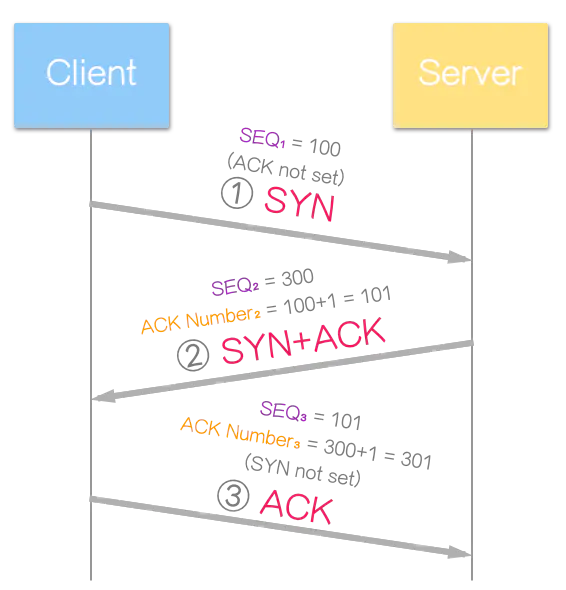
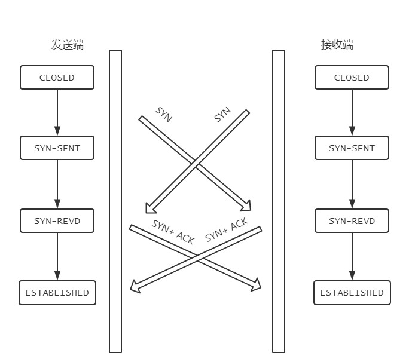

# TCP

前置词汇：

* **SYN**：**同步序列编号**（**Synchronize Sequence Numbers**）。是TCP/IP建立连接时使用的握手信号。在客户机和[服务器](https://baike.baidu.com/item/服务器/100571)之间建立正常的TCP网络连接时，客户机首先发出一个SYN消息，服务器使用SYN+ACK应答表示接收到了这个消息，最后客户机再以[ACK](https://baike.baidu.com/item/ACK)消息响应。这样在客户机和服务器之间才能建立起可靠的TCP连接，数据才可以在客户机和[服务器](https://baike.baidu.com/item/服务器/100571)之间传递。

  [TCP](https://baike.baidu.com/item/TCP)连接的第一个包，非常小的一种[数据包](https://baike.baidu.com/item/数据包/489739)。SYN 攻击包括大量此类的包，由于这些包看上去来自实际不存在的站点，因此无法有效进行处理。每个机器的欺骗包都要花几秒钟进行尝试方可放弃提供正常响应。

  凡是需要对端确认的，一定消耗TCP报文的序列号。

* **ACK**：**确认字符**(**Acknowledge character**）。在数据通信中，接收站发给发送站的一种传输类[控制字符](https://baike.baidu.com/item/控制字符/6913704)。表示发来的数据已确认接收无误。

  在[TCP/IP协议](https://baike.baidu.com/item/TCP%2FIP协议)中，如果接收方成功的接收到数据，那么会回复一个ACK数据。通常ACK信号有自己固定的格式,长度大小,由接收方回复给发送方。

* **seq**、**ack**：seq是序列号，这是为了连接以后传送数据用的，ack是对收到百的数据包的确认，值是等待接收的数据包的序列号。
  在第一次消息发送中，A随机选取一个序列号作为自己的初始序号发送给B；第二次消息B使用度ack对A的数据包进行确认，因为已经收到了序列号为x的数据包，准备接收序列号为x+1的包，所以ack=x+1，同时B告诉A自己的初始序列号，就是seq=y；第三回条消息A告诉B收到了B的确认消息并准备建立连接，A自己此条消息的序列号是x+1，所以seq=x+1，而ack=y+1是表示A正准备接收B序列号为答y+1的数据包。

  **seq是数据包本身的序列号；ack是期望对方继续发送的那个数据包的序列号。**

## 简述

  简单的讲，通常发起请求，是http协议（高级的应用层协议），其底层是TCP。
TCP的协议是说，客户端（请求方，主动发起）、服务端（响应方）如何连接的。
三次握手的举例：员工投简历，公司发邮件约面试，员工回复准时赴约。
三次握手的深入举例：
	客户端有基本数据x，服务端有基本数据y
	1、客户端：x 发送
	2、服务端：x + 1回去，再带上自己的y
	3、客户端：y + 1回去
	ps: 细品“回去”，+1就是告诉对方，我肯定知道你给我的是啥
三次握手的实际情况：
	1、客户端：SYN=1,seq=x
	2、服务端：SYN=1,ACK=1,seq=y,ack=x+1
	3、客户端：ACK=1,seq=x+1,ack=y+1

## 简述2

`SEQ`，序列号，表示每次传输中字节的偏移量 `ACK`，确认号，指出下一个期望接收的`SEQ`(接受完毕)

举个例子：

1. 序列号为`＃2000`且长度为`100`的数据包，在此连接上包含第`2000-2099`个字节。
2. 当接收器接收到包括第`2099`字节在内的所有字节时，它发送一个确认`＃2100`。
3. 表示它已在第`2100`字节之前接收到该字节。

## TCP 连接的“三次握手”

第一次握手：客户端发送SYN包(syn=j)到服务器，并进入**SYN_SEND**状态，等待服务器确认； 

第二次握手：服务器收到syn包，必须确认客户的SYN（ack=j+1），同时自己也发送一个SYN包（syn=k），即SYN+ACK包，此时服务器进入**SYN_RECV**状态；

 第三次握手：客户端收到服务器的SYN＋ACK包，向服务器发送确认包ACK(ack=k+1)，此包发送完毕，客户端和服务器进入**ESTABLISHED**状态，完成三次握手。 

握手过程中传送的包里不包含数据，三次握手完毕后，客户端与服务器才正式开始传送数据。

理想状态下，TCP连接一旦建立，在通信双方中的任何一方主动关闭连接之前，TCP 连接都将被一直保持下去。

断开连接时服务器和客户端均可以主动发起断开TCP连接的请求，断开过程需要经过“四次挥手”

## TCP 断开的“四次挥手”

因为服务端在接收到`FIN`, 往往不会立即返回`FIN`, 必须等到服务端所有的报文都发送完毕了，才能发`FIN`。因此先发一个`ACK`表示已经收到客户端的`FIN`，延迟一段时间才发`FIN`。这就造成了四次挥手。

### 如果是三次挥手会有什么问题？

等于说服务端将`ACK`和`FIN`的发送合并为一次挥手，这个时候长时间的延迟可能会导致客户端误以为`FIN`没有到达客户端，从而让客户端不断的重发`FIN`。

## 为什么TIME_WAIT状态需要经过2MSL(最大报文段生存时间)才能返回到CLOSE状态？

虽然按道理，四个报文都发送完毕，我们可以直接进入CLOSE状态了，但是我们必须假象网络是不可靠的，有可以最后一个ACK丢失。所以TIME_WAIT状态就是用来重发可能丢失的ACK报文。在Client发送出最后的ACK回复，但该ACK可能丢失。Server如果没有收到ACK，将不断重复发送FIN片段。所以Client不能立即关闭，它必须确认Server接收到了该ACK。Client会在发送出ACK之后进入到TIME_WAIT状态。Client会设置一个计时器，等待2MSL的时间。如果在该时间内再次收到FIN，那么Client会重发ACK并再次等待2MSL。所谓的2MSL是两倍的MSL(Maximum Segment Lifetime)。MSL指一个片段在网络中最大的存活时间，2MSL就是一个发送和一个回复所需的最大时间。如果直到2MSL，Client都没有再次收到FIN，那么Client推断ACK已经被成功接收，则结束TCP连接。

## 为什么不能用两次握手进行连接？

> 如果两次就ok，则服务器只要收到一个对应的是数据包，则默认建立连接，造成资源浪费。

3次握手完成两个重要的功能，既要双方做好发送数据的准备工作(双方都知道彼此已准备好)，也要允许双方就初始序列号进行协商，这个序列号在握手过程中被发送和确认。

现在把三次握手改成仅需要两次握手，死锁是可能发生的。作为例子，考虑计算机S和C之间的通信，假定C给S发送一个连接请求分组，S收到了这个分组，并发 送了确认应答分组。按照两次握手的协定，S认为连接已经成功地建立了，可以开始发送数据分组。可是，C在S的应答分组在传输中被丢失的情况下，将不知道S 是否已准备好，不知道S建立什么样的序列号，C甚至怀疑S是否收到自己的连接请求分组。在这种情况下，C认为连接还未建立成功，将忽略S发来的任何数据分 组，只等待连接确认应答分组。而S在发出的分组超时后，重复发送同样的分组。这样就形成了死锁。

## 如果已经建立了连接，但是客户端突然出现故障了怎么办？

TCP还设有一个保活计时器，显然，客户端如果出现故障，服务器不能一直等下去，白白浪费资源。服务器每收到一次客户端的请求后都会重新复位这个计时器，时间通常是设置为2小时，若两小时还没有收到客户端的任何数据，服务器就会发送一个探测报文段，以后每隔75秒钟发送一次。若一连发送10个探测报文仍然没反应，服务器就认为客户端出了故障，接着就关闭连接。

## 能不能说一说 TCP 和 UDP 的区别？

首先概括一下基本的区别:

**TCP是一个面向连接的、可靠的、基于字节流的传输层协议。**

而**UDP是一个面向无连接的传输层协议。**(就这么简单，其它TCP的特性也就没有了)。

具体来分析，和 `UDP` 相比，`TCP` 有三大核心特性:

1. **面向连接**。所谓的连接，指的是客户端和服务器的连接，在双方互相通信之前，TCP 需要三次握手建立连接，而 UDP 没有相应建立连接的过程。
2. **可靠性**。TCP 花了非常多的功夫保证连接的可靠，这个可靠性体现在哪些方面呢？一个是有状态，另一个是可控制。

TCP 会精准记录哪些数据发送了，哪些数据被对方接收了，哪些没有被接收到，而且保证数据包按序到达，不允许半点差错。这是**有状态**。

当意识到丢包了或者网络环境不佳，TCP 会根据具体情况调整自己的行为，控制自己的发送速度或者重发。这是**可控制**。

相应的，UDP 就是`无状态`, `不可控`的。

1. **面向字节流**。UDP 的数据传输是基于数据报的，这是因为仅仅只是继承了 IP 层的特性，而 TCP 为了维护状态，将一个个 IP 包变成了字节流。

##  三次握手过程中可以携带数据么？

第三次握手的时候，可以携带。前两次握手不能携带数据。

如果前两次握手能够携带数据，那么一旦有人想攻击服务器，那么他只需要在第一次握手中的 SYN 报文中放大量数据，那么服务器势必会消耗更多的**时间**和**内存空间**去处理这些数据，增大了服务器被攻击的风险。

第三次握手的时候，客户端已经处于`ESTABLISHED`状态，并且已经能够确认服务器的接收、发送能力正常，这个时候相对安全了，可以携带数据。

## 同时建立TCP连接

> 不会阻塞，正常连接

在发送方给接收方发`SYN`报文的同时，接收方也给发送方发`SYN`报文，两个人刚上了!

发完`SYN`，两者的状态都变为`SYN-SENT`。

在各自收到对方的`SYN`后，两者状态都变为`SYN-REVD`。

接着会回复对应的`ACK + SYN`，这个报文在对方接收之后，两者状态一起变为`ESTABLISHED`。

这就是同时打开情况下的状态变迁。

## 说说半连接队列和 SYN Flood 攻击的关系

三次握手前，服务端的状态从`CLOSED`变为`LISTEN`, 同时在内部创建了两个队列：**半连接队列**和**全连接队列**，即**SYN队列**和**ACCEPT队列**。

### 半连接队列

当客户端发送`SYN`到服务端，服务端收到以后回复`ACK`和`SYN`，状态由`LISTEN`变为`SYN_RCVD`，此时这个连接就被推入了**SYN队列**，也就是**半连接队列**。

### 全连接队列

当客户端返回`ACK`, 服务端接收后，三次握手完成。这个时候连接等待被具体的应用取走，在被取走之前，它会被推入另外一个 TCP 维护的队列，也就是**全连接队列(Accept Queue)**。

### SYN Flood 攻击原理

SYN Flood 属于典型的 DoS/DDoS 攻击。其攻击的原理很简单，就是用客户端在短时间内伪造大量不存在的 IP 地址，并向服务端疯狂发送`SYN`。对于服务端而言，会产生两个危险的后果:

1. 处理大量的`SYN`包并返回对应`ACK`, 势必有大量连接处于`SYN_RCVD`状态，从而占满整个**半连接队列**，无法处理正常的请求。

2. 由于是不存在的 IP，服务端长时间收不到客户端的`ACK`，会导致服务端不断重发数据，直到耗尽服务端的资源。

### 如何应对 SYN Flood 攻击？

1. 增加 SYN 连接，也就是增加半连接队列的容量。
2. 减少 SYN + ACK 重试次数，避免大量的超时重发。
3. 利用 SYN Cookie 技术，在服务端接收到`SYN`后不立即分配连接资源，而是根据这个`SYN`计算出一个Cookie，连同第二次握手回复给客户端，在客户端回复`ACK`的时候带上这个`Cookie`值，服务端验证 Cookie 合法之后才分配连接资源。
